# FórumHub API

##  Sobre o projeto
O **FórumHub** é uma API REST desenvolvida em Java com Spring Boot, cujo objetivo é gerenciar tópicos de um fórum de discussão.  
Este projeto foi construído como parte de um **desafio técnico**, simulando um sistema real utilizado para criação, consulta, atualização e exclusão de tópicos, com controle de acesso e autenticação via token JWT.

A aplicação foi desenvolvida seguindo boas práticas, com versionamento em Git/GitHub e documentação clara por meio deste README.

---

##  Funcionalidades
- Cadastro de novos tópicos
- Listagem de tópicos
- Detalhamento de tópico por ID
- Atualização de tópicos
- Exclusão de tópicos:
  - Exclusão física (remoção definitiva do registro)
  - Exclusão lógica (alteração de status, mantendo o histórico)
- Autenticação de usuários
- Controle de acesso com Spring Security
- Autorização via Token JWT

---

##  Tecnologias utilizadas
- Java 17+
- Spring Boot 3+
- Maven
- Spring Web
- Spring Data JPA
- Spring Security
- JWT (JSON Web Token)
- Flyway Migration
- MySQL (ou PostgreSQL)
- Lombok
- Bean Validation
- Git e GitHub
- Postman / Insomnia

---

##  Versionamento e organização
O projeto utiliza **Git e GitHub** para versionamento de código, permitindo acompanhar a evolução da aplicação de forma incremental.  
Mesmo antes da implementação completa, o repositório já contém a estrutura inicial do projeto e este README como documentação principal.

---

##  Pré-requisitos
Antes de executar o projeto, é necessário ter instalado:

- Java JDK 17 ou superior
- Maven 4 ou superior
- Banco de dados relacional (MySQL 8+ ou PostgreSQL)
- IDE de sua preferência (IntelliJ IDEA recomendado)
- Postman ou Insomnia para testes da API

---

##  Configuração do ambiente

### Criação do projeto
O projeto foi criado utilizando o **Spring Initializr**, com as seguintes configurações:

- Project: Maven
- Language: Java
- Spring Boot: 3+
- Packaging: JAR
- Java: 17+

### Dependências
As principais dependências utilizadas no projeto são:

- **Spring Web MVC**  
  Responsável pela criação dos endpoints REST da aplicação.

- **Spring Data JPA**  
  Abstração para persistência de dados e integração com o banco relacional.

- **Spring Security**  
  Implementação de autenticação e controle de acesso à API.

- **Bean Validation**  
  Validação dos dados de entrada utilizando anotações como `@Valid` e `@NotNull`.

- **Flyway Migration**  
  Controle de versão e gerenciamento das migrations do banco de dados.

- **PostgreSQL Driver**  
  Driver JDBC utilizado para conexão com o banco de dados PostgreSQL.

- **JWT (java-jwt – Auth0)**  
  Geração e validação de tokens JWT para autenticação e autorização.

- **Lombok**  
  Redução de código boilerplate (getters, setters, construtores, etc.).

- **Jackson JSR-310**  
  Suporte à serialização e desserialização de tipos de data/hora do Java (`LocalDateTime`).

- **Spring Boot DevTools**  
  Ferramentas para facilitar o desenvolvimento, como reload automático.

---

##  Banco de dados
A aplicação utiliza um banco de dados relacional para armazenar os tópicos do fórum.

### Estrutura da tabela de tópicos
Campos principais:
- id
- titulo
- mensagem
- data_criacao
- status
- autor
- curso

> Observação: o foco do desafio é a entidade **Tópico**. A modelagem de outras tabelas é opcional.

---

##  Migrations
O versionamento do banco de dados é feito com **Flyway**.

- As migrations são criadas em arquivos `.sql`
- Responsáveis pela criação e evolução das tabelas
- Observação: sempre que uma migration for criada ou alterada, a aplicação deve estar **parada**. 
  - Após a criação ou modificação da migration, é necessário **reiniciar a aplicação** para que o Flyway execute as mudanças no banco de dados.

---

##  Endpoints da API

###  Cadastro de tópico
`POST /topicos`

- Envia os dados no corpo da requisição (JSON)
- Todos os campos são obrigatórios
- Não permite tópicos duplicados (mesmo título e mensagem)

---

###  Listagem de tópicos
`GET /topicos`

- Retorna todos os tópicos cadastrados
- Opcional:
    - Paginação
    - Ordenação por data de criação
    - Filtros por curso ou ano

---

###  Detalhamento de tópico
`GET /topicos/{id}`

- Retorna os detalhes de um tópico específico
- Valida se o ID existe no banco de dados

---

###  Atualização de tópico
`PUT /topicos/{id}`

- Atualiza os dados de um tópico existente
- As mesmas regras de validação do cadastro se aplicam
- Verifica se o tópico existe antes da atualização

---

###  Exclusão de tópico

A aplicação implementa **exclusão física** e **exclusão lógica por inativação**, permitindo maior controle e preservação do histórico dos dados.

####  Exclusão física
`DELETE /topicos/{id}`

- Remove o tópico **definitivamente** do banco de dados
- Valida a existência do tópico antes da exclusão

####  Exclusão lógica (inativar / ativar)
`PATCH /topicos/inativar/{id}`
`PATCH /topicos/ativar/{id}`

- O tópico **não é removido fisicamente** do banco de dados
- O status do tópico é alterado para **INATIVO** ou **ATIVO**
- Permite reativar tópicos previamente inativados
- Mantém o histórico das informações
- Tópicos inativados **não são retornados nas listagens padrão**

---

##  Autenticação e segurança
A aplicação utiliza **Spring Security** para proteger os endpoints.

- Apenas usuários autenticados podem acessar a API
- Endpoint de login para autenticação
- Uso de DTOs para login e senha
- Validação de dados com `@Valid`

## Exemplo de endpoint de autenticação:

##  Token JWT e controle de acesso
Após a autenticação, a API gera um **Token JWT**, que deve ser enviado nas próximas requisições.

- Geração do token com algoritmo HMAC256
- Token possui tempo de expiração
- Segredo e expiração configurados no `application.properties`
- Filtro/interceptor responsável por validar o token em cada requisição
- Endpoints protegidos exigem token válido no header

---

##  Testes da API
Os testes podem ser realizados utilizando:

- Postman
- Insomnia

É possível testar:
- Cadastro
- Listagem
- Atualização
- Exclusão
- Autenticação
- Validação do token JWT

---

##  Demonstração
Esta seção apresenta evidências do funcionamento da API por meio de capturas de tela das requisições e respostas realizadas no Postman/Postgres.

###  Autenticação (JWT)
Requisição de login para geração do token JWT.

- Login de usuário
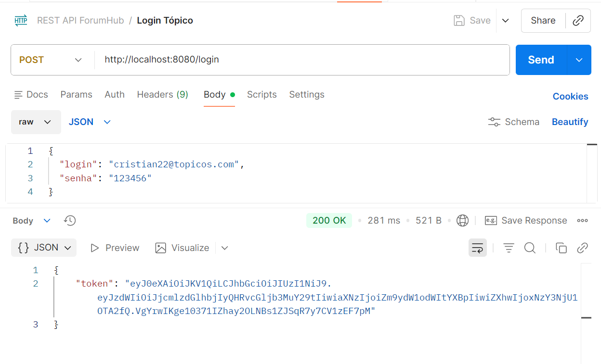
- Passando email errado
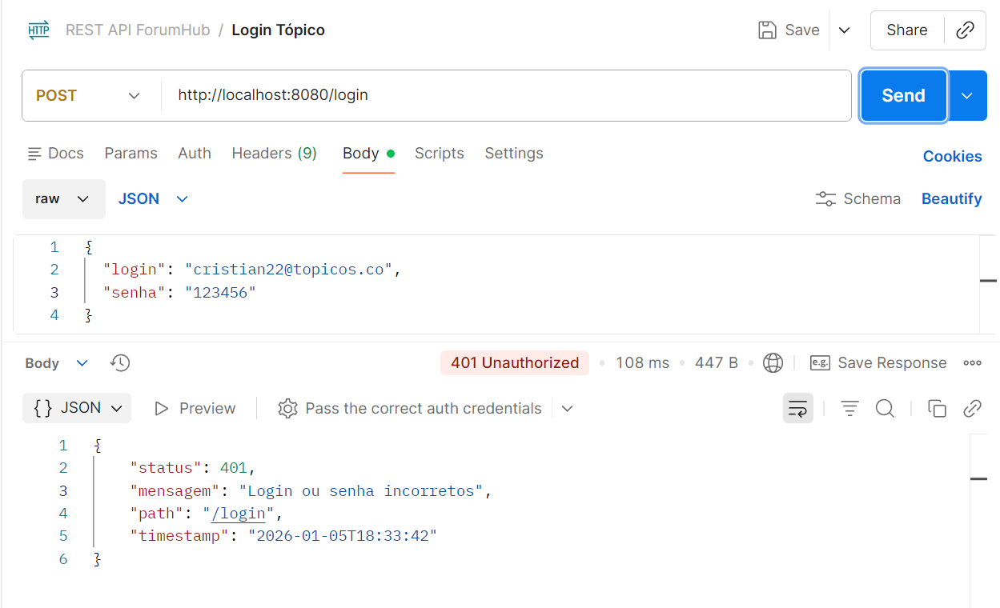
- Passando senha errada
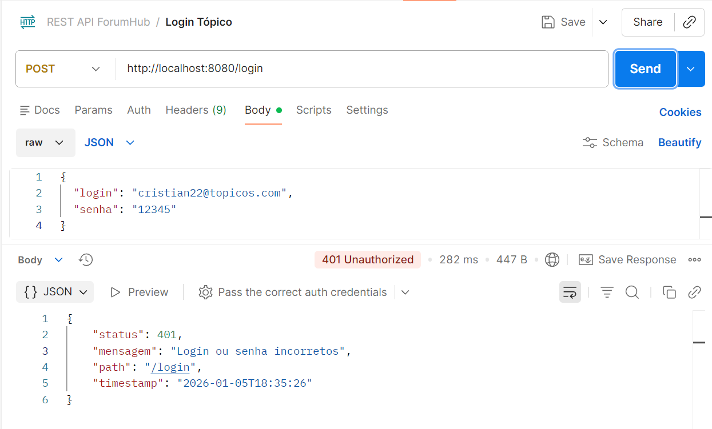

###  Cadastro de tópico
Criação de um novo tópico enviando os dados no corpo da requisição.

- Cadastrar tópico
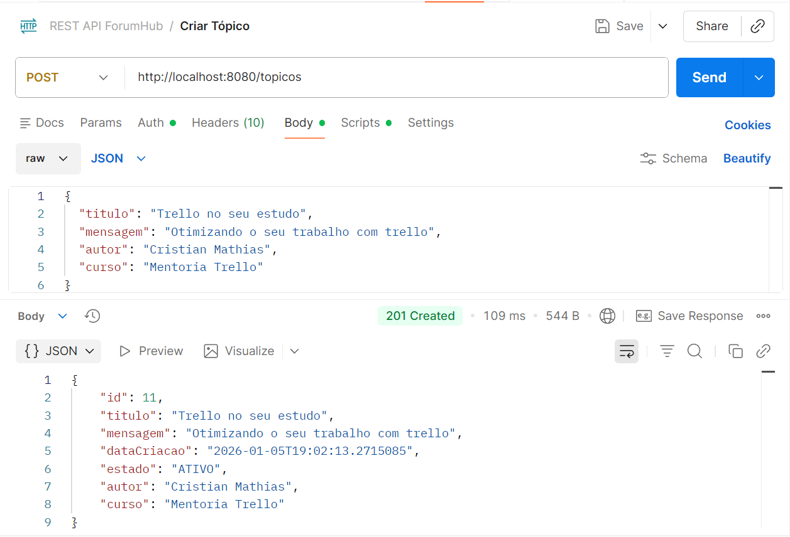
- Cadastrar tópico sem token

###  Listagem de tópicos
Listagem dos tópicos ativos cadastrados no sistema.
- Listar tópicos
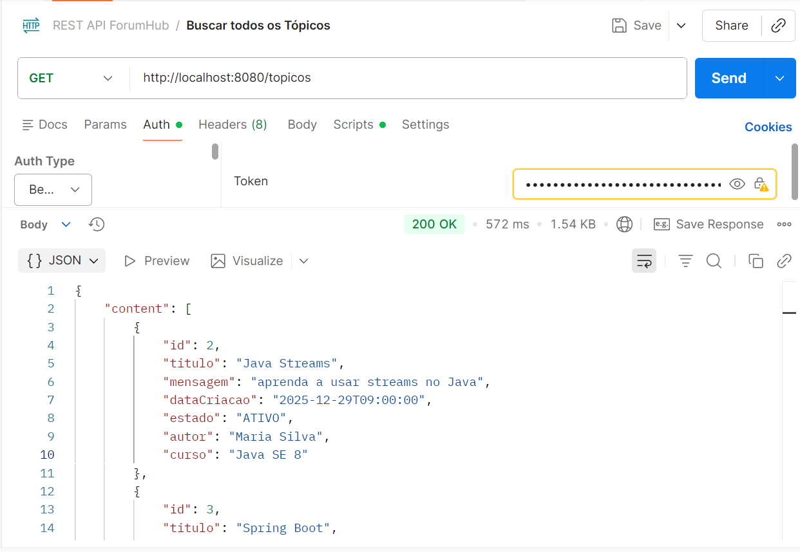
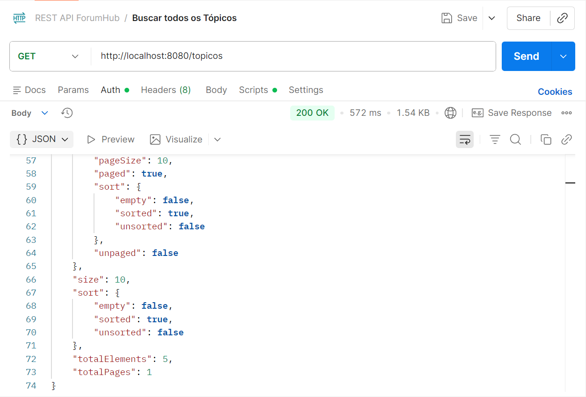
- Listar tópicos sem token
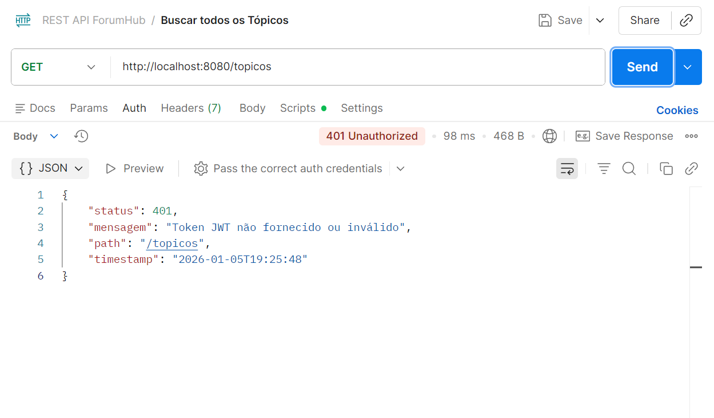

###  Detalhamento de tópico
Consulta dos dados de um tópico específico por ID.

- Listar por ID
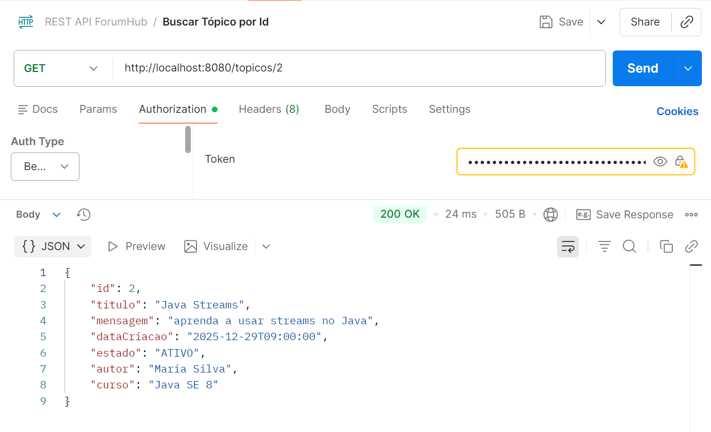
- Listar por ID sem token
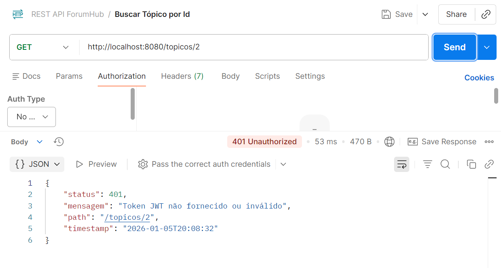
- Listar por ID inexistente
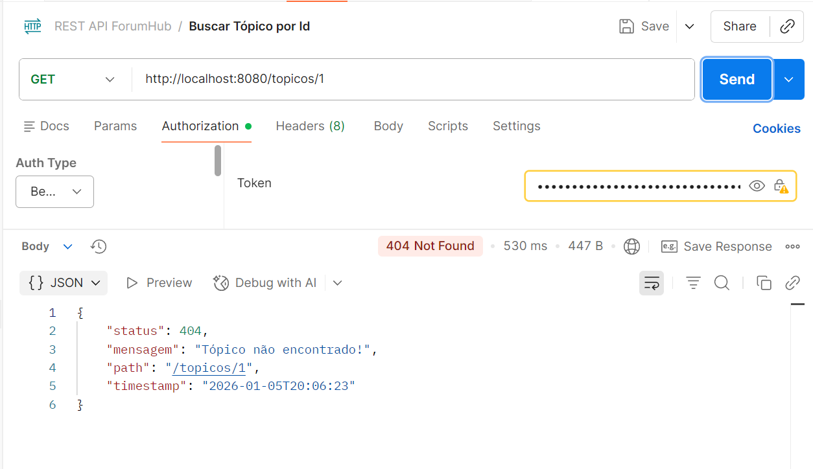

###  Atualização de tópico
Atualização das informações de um tópico existente.

- Atualizar tópico
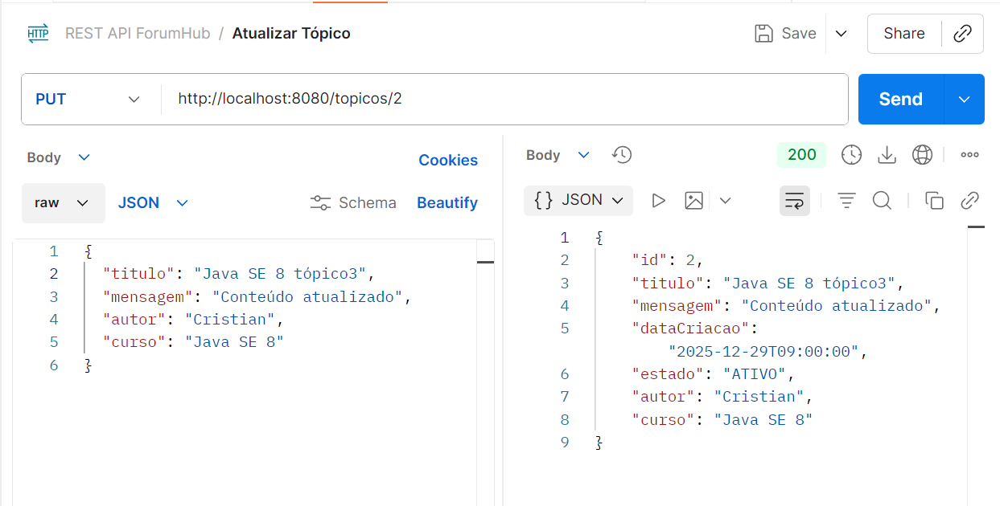
- Atualizar tópico sem token
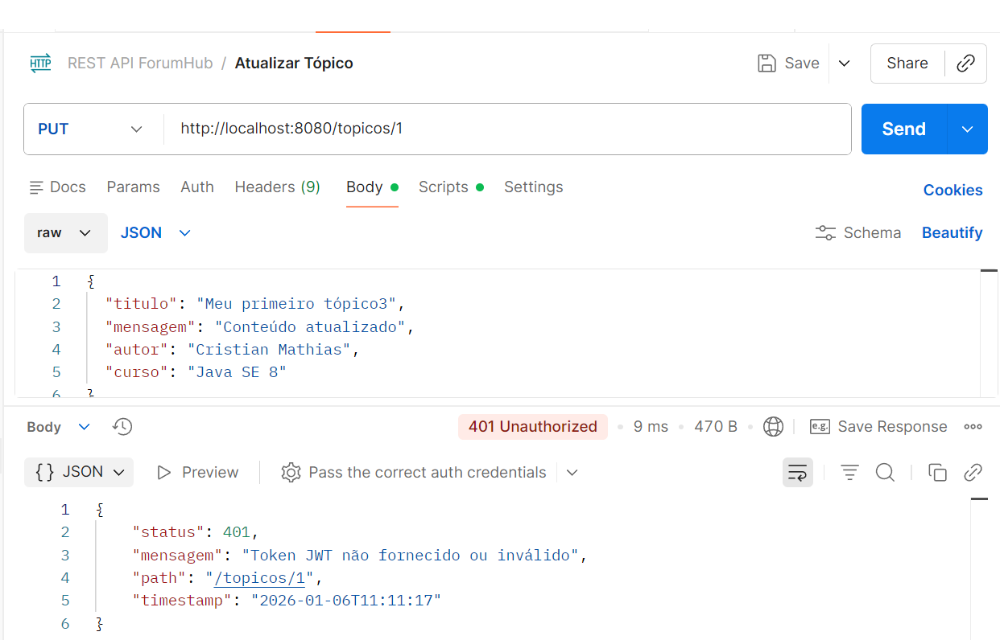
- Atualizar tópico inativo
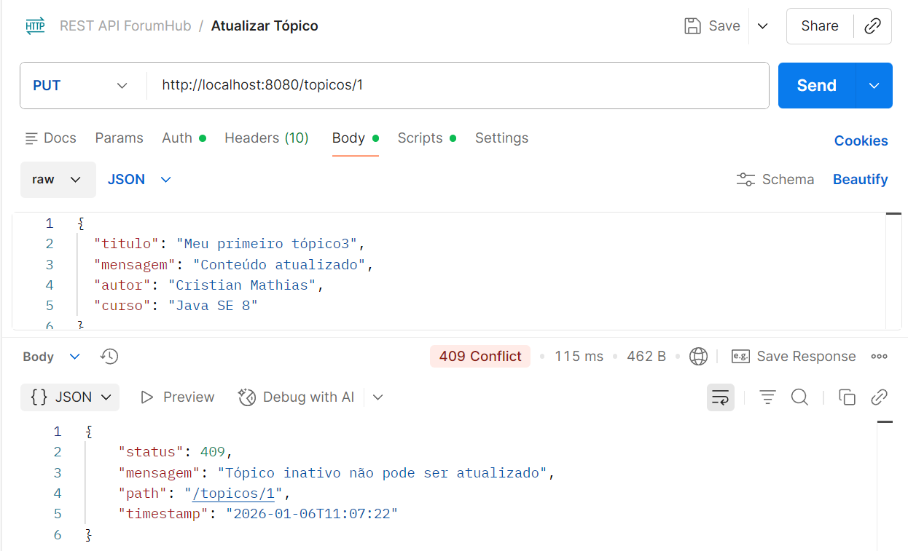

###  Exclusão física de tópico
Remoção definitiva do tópico do banco de dados.

- Exclusão física de tópico
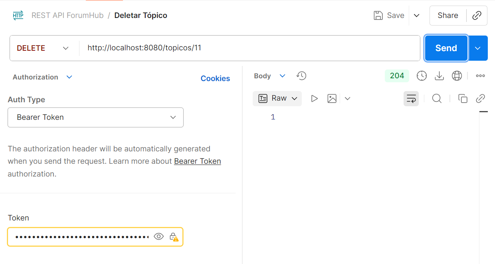
- Exclusão física sem token
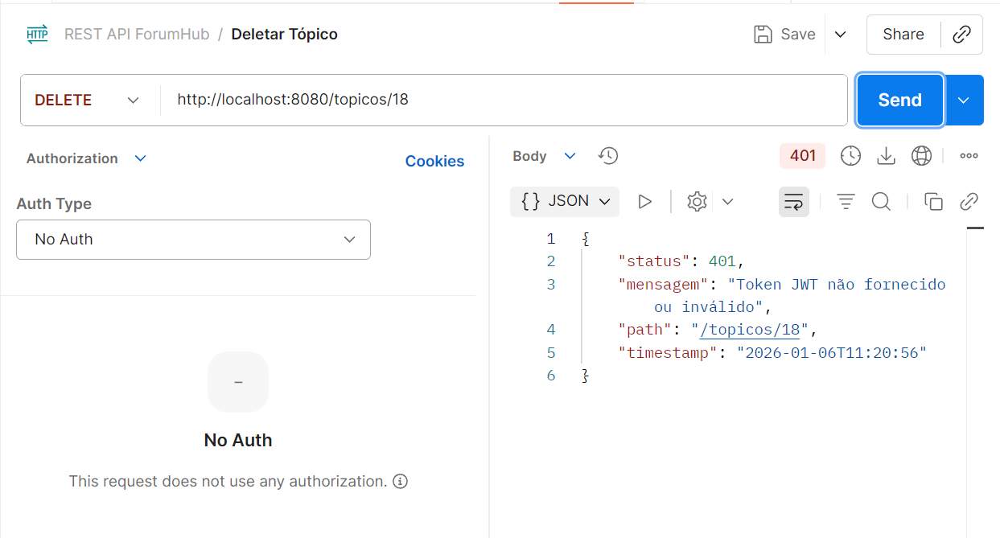
- Exclusão física de tópico inexistente

###  Inativação / Ativação de tópico
Alteração do status do tópico utilizando exclusão lógica.

- Inativar tópico com id 2
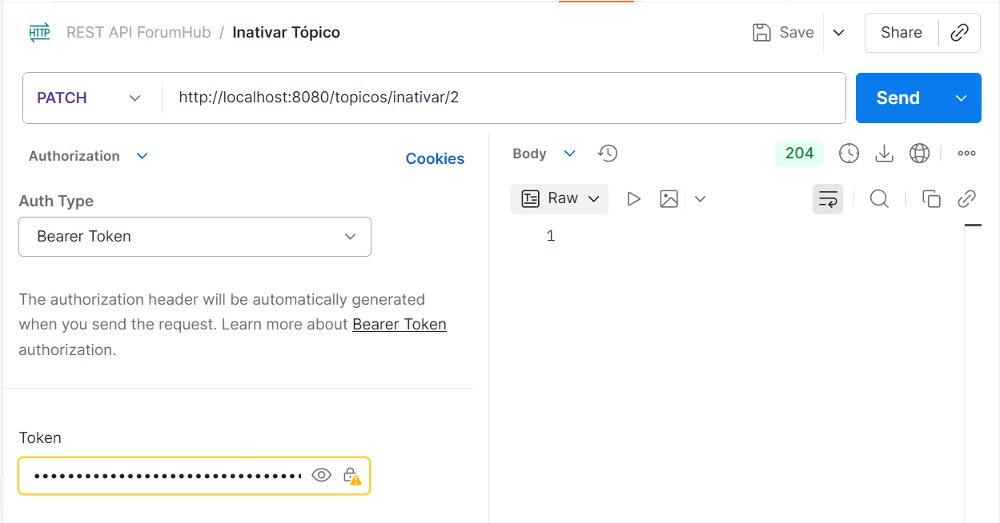
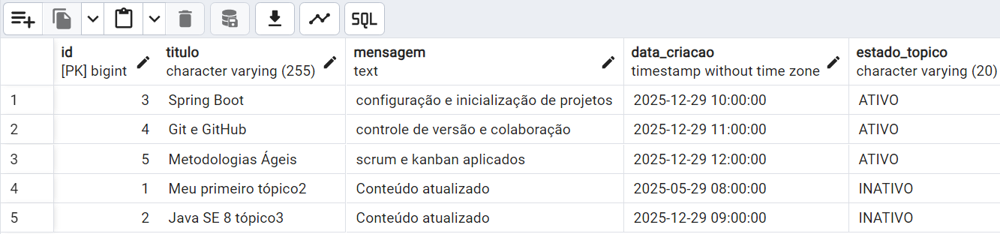
- Ativar tópico com id 2
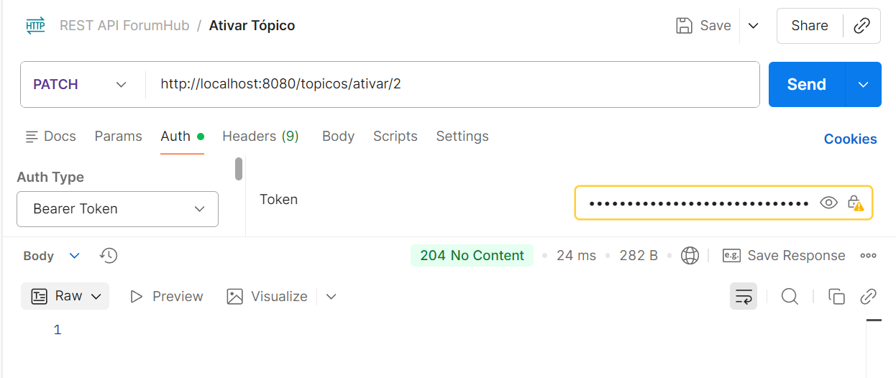

---

##  Documentação da API (Swagger)

A documentação interativa da API está disponível via Swagger:

🔗 **Swagger UI:**  
http://localhost:8080/swagger-ui.html

🔗 **OpenAPI (JSON):**  
http://localhost:8080/v3/api-docs

>  **OBSERVAÇÃO**: Para acessar endpoints protegidos no Swagger, utilize o botão **Authorize** e informe **apenas o token JWT**, sem o prefixo `Bearer`.
